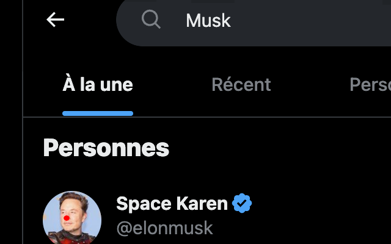
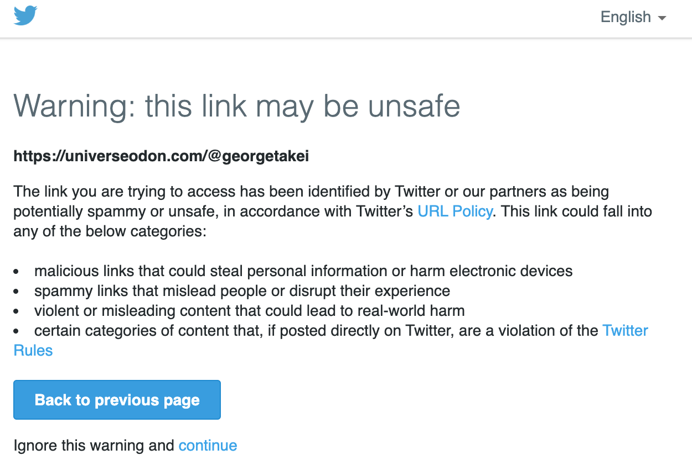

# Chrome Extension : Fix Space Karen



## What does it do?

This extension is designed to improve your Twitter experience by :

* Remove attempts to scare people during redirection to known Mastodon servers (exemple of such attemp below)
* Replace all occurrences of `Elon Musk` to `Space Karen`

### Screenshot of trying to retain people with FUD



## How to use it

To use our extension, install the extension from the Chrome Web Store (insert link).

## Text sent to the Chrome Web Store

### You have declared host access permission. A thorough review of your extension will therefore be necessary, which will delay its publication

```
So, the poor folks over Twitter were instructed to add a scary screen when they click on a Mastodon URL. "Boooo, you're about to go to an unsafe URL".

What. A. Sad. Joke.

In order to bypass that, the extension is using a service_worker / chrome.tabs.onUpdated.addListener and will redirect the user to the URL if it's within a list extracted from https://joinmastodon.org/servers.

Additionally, I could not start my weekend without turning all occurrences of "Elon Musk" into "Space Karen". Because, you know... And to do that, I'm looking at the content of the DOM through some code activated by manifest.json/content_scripts.

Toodaloo
```
