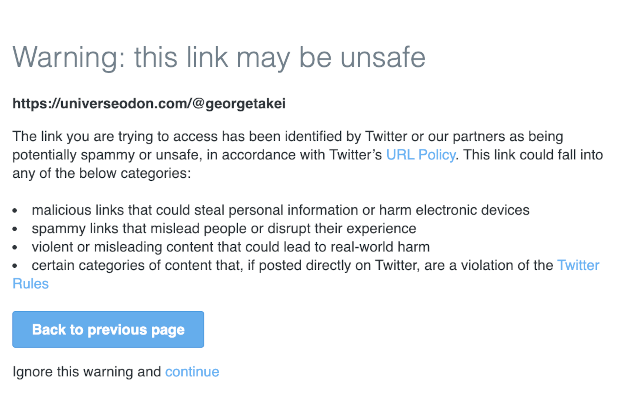

Update 22 December > Twitter revert their approach and Mastodon links are not prevented anymore, so the main feature of this extension is not needed anymore.You can still install it to change the name of `Elon Musk` to `Space Karen`.

# Mastodon Redirections Fix for Twitter

## Why?

Under Elon Musk's new management, Twitter has banned [Mastodon](https://en.wikipedia.org/wiki/Mastodon_(social_network)) links in some tweets for being “malware” or unsafe. It's an unfortunate tactic, known as FUD (stands for "fear, uncertainty, and doubt"), which is used to try to discredit a competitor or a competing product or service by spreading negative or false information about it. In the context of trying to make a competitor seem unsafe, this might involve spreading misinformation or false claims about the safety of the competitor's products or services in order to make people hesitant to use them.

This type of tactic is generally considered unethical and is not a legitimate way to compete in the market. It is important for businesses to compete on the quality and value of their products or services rather than trying to spread fear or uncertainty about their competitors. This type of behavior can also harm consumers, who may be misled by the false information and make choices that are not in their best interests.

This extension is designed to improve your Twitter experience by :

* Remove attempts to scare people during redirection to known Mastodon servers
* Replace all occurrences of `Elon Musk` to `Space Karen`

## How to use it

To use this extension, install it through the [Chrome Web Store](https://chrome.google.com/webstore/detail/mastodon-redirections-fix/dleaknoafhnllflgdjpiekbaknmlhkfk).
